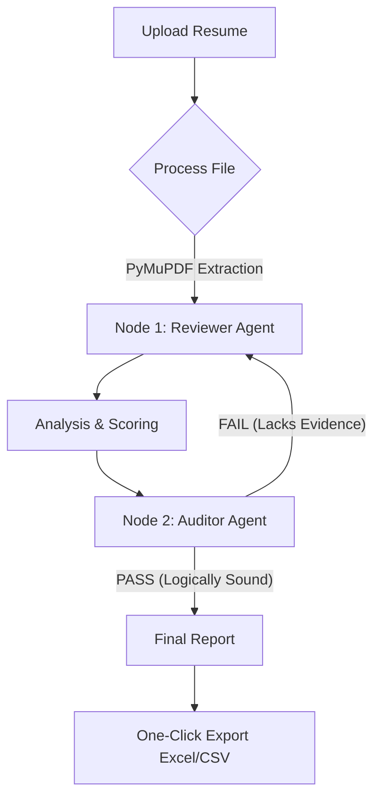

# Skrut AI

[](https://www.python.org/)
[](https://fastapi.tiangolo.com/)
[](https://nextjs.org/)
[](https://www.typescriptlang.org/)
[](https://openai.com/)
[](LICENSE)

**The Intelligent Resume Evaluation Agent for Modern HR.**

Skrut AI is a high-performance, privacy-first tool designed to help recruiters evaluate resumes beyond simple keyword matching. By leveraging a multi-agent orchestration pattern, Skrut AI analyzes candidate potential, identifies transferable skills, and provides evidence-based scoring to streamline your hiring process.

## Key Features

- **Multi-Agent Review (LangGraph):** Dual-agent system (Reviewer & Auditor) that debates candidate fit to ensure fair, unbiased, and balanced evaluation.
- **Intelligent Skill Mapping:** Identifies "Skill Families" to recognize transferable potential (e.g., Vue vs. React) beyond rigid keyword matching.
- **Anti-Hallucination Guardrails:** Strict automated verification of all claims against resume text to prevent "AI inventions" and unverified potential.
- **High-Performance Text Extraction:** Rapidly processes large PDF documents using PyMuPDF (optimized for speed and memory).
- **Stateless Privacy:** Candidate resumes are processed in-memory and deleted immediately after analysis. No personal data is ever stored in a database.
- **Professional Exports:** One-click generation of Excel (.xlsx) and CSV reports for easy team sharing and tracking.
- **Session Continuity:** Automatically recovers your latest evaluation results using browser session storage, preventing data loss.

## Tech Stack

### Backend

- **Framework:** FastAPI (Python 3.12+)
- **AI Logic:** LangChain & LangGraph Orchestration
- **Models:** OpenAI GPT-4o-mini (Optimized temperatures per agent role)
- **Document Processing:** PyMuPDF (High-speed text extraction)

### Frontend

- **Framework:** Next.js 15 (React 19)
- **Styling:** Tailwind CSS (Modern premium aesthetic)
- **State Management:** React Hooks & SessionStorage API
- **Language:** TypeScript

## Project Structure

```text
├── backend/
│   ├── services/           # Core AI & Extraction logic
│   │   ├── ai.py           # LangGraph agents (Reviewer & Auditor)
│   │   └── ocr.py          # Text extraction engine (PyMuPDF)
│   ├── tests/              # Backend test suite
│   ├── data/               # Local data storage (Logs/Config)
│   └── main.py             # FastAPI Entry point
├── frontend/
│   ├── app/                # Next.js 15 App Router
│   │   ├── components/     # UI Design System
│   │   ├── upload/         # Upload & Processing page
│   │   └── results/        # Evaluation dashboard
│   └── package.json
└── README.md
```

## Getting Started

### Prerequisites

- [Bun](https://bun.sh/) (Fast JS Runtime)
- [uv](https://docs.astral.sh/uv/) (Extremely fast Python package manager)
- OpenAI API Key

### 1. Backend Setup

```bash
cd backend
uv sync  # Installs all dependencies into a virtual environment
# Create .env and add OPENAI_API_KEY=your_key
uv run main.py
```

### 2. Frontend Setup

```bash
cd frontend
bun install
bun run dev
```

## System Workflow



## How the Analysis Works (The Agent Loop)

1.  **Ingestion:** The system extracts raw text from the uploaded PDF using the high-performance PyMuPDF engine.
2.  **The Review (Node 1):** The "Reviewer" agent performs a deep dive, looking for strengths, skill family overlaps, and growth areas. It generates a score (0-10).
3.  **The Audit (Node 2):** The "Auditor" agent (running at 0.0 temperature for maximum consistency) checks the review for logical fallacies or hallucinated skills.
4.  **The Refinement:** If the Auditor finds the report "unrealistically positive" or "lacking evidence," it sends the report back to Node 1 with specific feedback. This loop repeats up to 3 times until a consensus is reached.
5.  **Output:** The final, human-verified-like report is presented in a clean, professional dashboard.

## Data Privacy & Security

Primacy-first design is at the core of Skrut AI. We ensure enterprise-grade data protection through:

- **Stateless Processing:** Candidate resumes are processed entirely in-memory. Files are never stored on a persistent disk during analysis.
- **Instant Deletion:** All session data and extracted text are wiped immediately after the analysis loop is completed or the session ends.
- **No Model Training:** We do NOT use your candidate data or evaluation results to train our models. Your proprietary hiring criteria remain private.
- **Secure Integration:** For On-premise deployments, all data stays within your firewall, ensuring 100% data sovereignty.

## On-premise Automation & Integration

If your organization requires a higher level of automation beyond manual uploads, I specialize in building custom, end-to-end hiring infrastructure.

### Enterprise Scraping Solutions

I have previously implemented a focused automation pipeline for **CPF (Charoen Pokphand Foods)** that sources data from **leading recruitment platforms** using **Playwright**. While the current implementation is platform-specific, I can customize and scale this architecture to support any major recruitment portal depending on your project requirements.

You can explore the open-source implementation of this core logic here:

- **Project:** [Recruitment Site Scraper](https://github.com/snui1s/recruitment_site_scraper)
- **Status:** Open for community use.
- **Policy:** Feel free to integrate this into your own systems if you have the technical expertise. I am happy to share this work; all I ask is that you provide proper attribution when using it in your projects.

---

## License

This project is licensed under the [Apache License 2.0](LICENSE).
