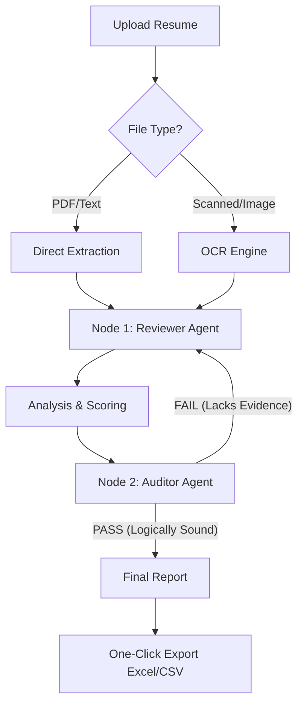

# Skrut AI

**The Intelligent Resume Evaluation Agent for Modern HR.**

Skrut AI is a high-performance, privacy-first tool designed to help recruiters evaluate resumes beyond simple keyword matching. By leveraging a multi-agent orchestration pattern, Skrut AI analyzes candidate potential, identifies transferable skills, and provides evidence-based scoring to streamline your hiring process.

## Key Features

- **Multi-Agent Review (LangGraph):** Dual-agent system (Reviewer & Auditor) that debates candidate fit to ensure fair, unbiased, and balanced evaluation.
- **Intelligent Skill Mapping:** Identifies "Skill Families" to recognize transferable potential (e.g., Vue vs. React) beyond rigid keyword matching.
- **Anti-Hallucination Guardrails:** Strict automated verification of all claims against resume text to prevent "AI inventions" and unverified potential.
- **Hybrid OCR Engine:** Seamlessly processes both text-based PDFs and scanned images using PyMuPDF and EasyOCR.
- **Stateless Privacy:** Candidate resumes are processed in-memory and deleted immediately after analysis. No personal data is ever stored in a database.
- **Professional Exports:** One-click generation of Excel (.xlsx) and CSV reports for easy team sharing and tracking.
- **Session Continuity:** Automatically recovers your latest evaluation results using browser session storage, preventing data loss.

## Tech Stack

### Backend

- **Framework:** FastAPI (Python 3.12+)
- **AI Logic:** LangChain & LangGraph Orchestration
- **Models:** OpenAI GPT-4o-mini (Optimized temperatures per agent role)
- **Document Processing:** PyMuPDF (Text) & EasyOCR (Scanned images)

### Frontend

- **Framework:** Next.js 15 (React 19)
- **Styling:** Tailwind CSS (Modern premium aesthetic)
- **State Management:** React Hooks & SessionStorage API
- **Language:** TypeScript

## Getting Started

### Prerequisites

- [Bun](https://bun.sh/) (Fast JS Runtime)
- [uv](https://docs.astral.sh/uv/) (Extremely fast Python package manager)
- OpenAI API Key

### 1. Backend Setup

```bash
cd backend
uv sync  # Installs all dependencies into a virtual environment
# Create .env and add OPENAI_API_KEY=your_key
uv run main.py
```

### 2. Frontend Setup

```bash
cd frontend
bun install
bun run dev
```

## System Workflow



## How the Analysis Works (The Agent Loop)

1.  **Ingestion:** The system extracts raw text from the uploaded file using the hybrid OCR engine.
2.  **The Review (Node 1):** The "Reviewer" agent performs a deep dive, looking for strengths, skill family overlaps, and growth areas. It generates a score (0-10).
3.  **The Audit (Node 2):** The "Auditor" agent (running at 0.0 temperature for maximum consistency) checks the review for logical fallacies or hallucinated skills.
4.  **The Refinement:** If the Auditor finds the report "unrealistically positive" or "lacking evidence," it sends the report back to Node 1 with specific feedback. This loop repeats up to 3 times until a consensus is reached.
5.  **Output:** The final, human-verified-like report is presented in a clean, professional dashboard.

## License

This project is licensed under the [Apache License 2.0](LICENSE).
